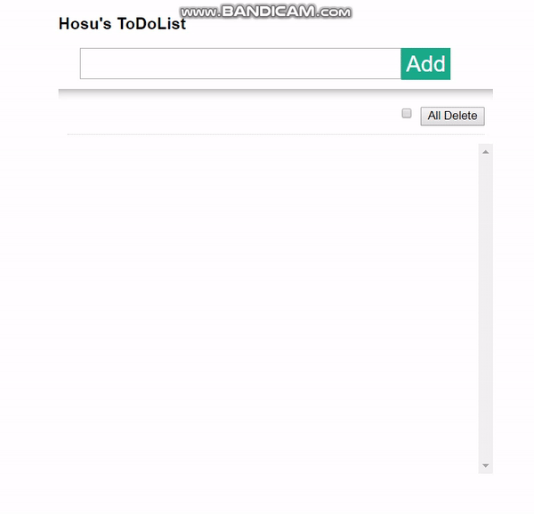
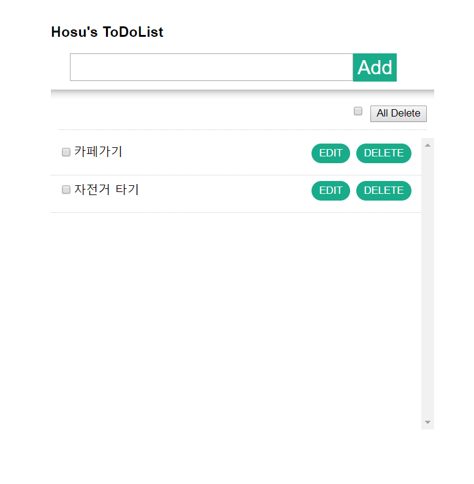
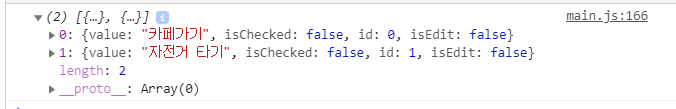
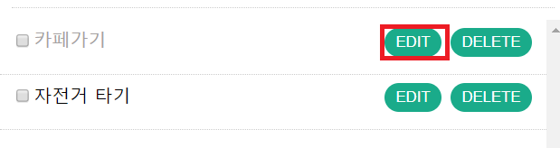
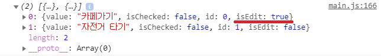
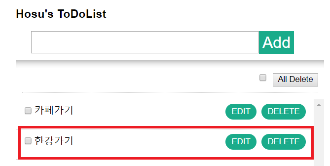
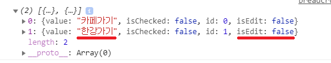
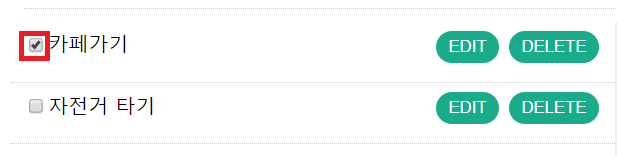
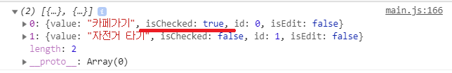
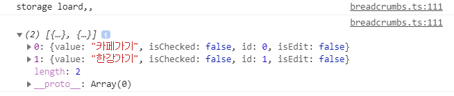


## ✨ Object와 rendering을 활용한 ToDoList 

### OverView

---
### add Event
- input tag에 text를 입력한 후 Add 버튼을 누르면 rendering을 통해
list가 입력된다.

- 그 후 console에서 확인해 보면, array에 잘 입력 된 것을 확인 할 수 있다.

---
### eidt Event
- 출력된 list에 text를 수정하고 싶다면 edit button을 클릭해 이벤트를 활성화시킨다.

- 배열에 저장되있는 isEdit 값이 true로 바뀌며 contentEditable이 활성화 됩니다.

- 수정을 한 뒤 edit를 다시 한번 click하게 되면 바뀐 text로 수정됩니다.

- console로 배열을 확인해보면 바뀐 text로 value가 수정되어있고 isEdit값도 false로 변경되어있음을 확인 할 수 있습니다.

---
### check Event

- 출력된 list에 해결 여부를 확인하려고 checkBox를 활성화 시키기위해 객체에 isChecked라는 속성을 추가해 checked일때 true를 표현했습니다.

- console에서 확인해보면 정상적으로 object의 속성 값이 변경된것을 확인 할 수 있다.
---
### LocalStorage Function
- 더욱 완벽한 todolist를 구현하기 위해 localstorage를 활용하여 list를 저장시키고 todoApp을 실행할때에 list를 불러올 수 있게 구현하였습니다.
1) save storage function
~~~
    localStorage.setItem("storageList",JSON.stringify(todos));
    localStorage.setItem("idCount",JSON.stringify(idCount));
~~~
- storage는 String형식으로만 저장가능하기때문에 JSON의 stringfy 메소드를 이용해 저장합니다.

2) load storage function
~~~
    todos = JSON.parse(localStorage.getItem("storageList"));
    idCount = Number(JSON.parse(localStorage.getItem("idCount")));
~~~
- storage에 저장된 객체 배열을 JSON의 parse 메소드를 이용해 storage에 저장되어있는 값들을 불러오는 load function을 구성하였습니다.

- localstorage에 저장된 todosApp 객체를 불러와 list에 rendering이 되어집니다.

---
### Important Function 
##### Rendering

~~~
    $list.innerHTML = todos.map(todo => template(todo)).join('');
    buttonEventBinder();
~~~
- Object Array의 map method를 이용해서 새로운 배열을 만든 후 화면에 뿌려줍니다. 
- 여기서 map() 메서드는 배열 내의 모든 요소 각각에 대하여 주어진 함수를 호출한 결과를 모아 새로운 배열을 반환합니다.
여기서 중요한 template 함수는,
~~~
 `
    <li class="item-list" data-key="${todos.id}">
        <label class="app-list">
          <input type="checkbox" class="checkbox" ${todos.isChecked ? "checked" : " "}>
        </label>
        ${todos.value}
        

            <button class="delete">Delete</button>
            <button class="edit">Edit</button>
        

    </li> 
 `;
~~~
- 백틱 (`) 을 활용하여 html의 template를 직접 만들어주는 function 입니다.
- rendering 함수는 이러한 template의 값들을 map이라는 객체의 메소드를 활용하여 todos 배열에 저장하여 innerHTML로 뿌려줍니다.
- rendering이 중요한 이유는 수정, 삭제, 체크박스 이벤트등 여러 화면을 control 해야할 때에 redering으로 화면에 다시 그려주기만 하면 실시간으로 바뀌는 '동기식' 구현이 가능해집니다.
