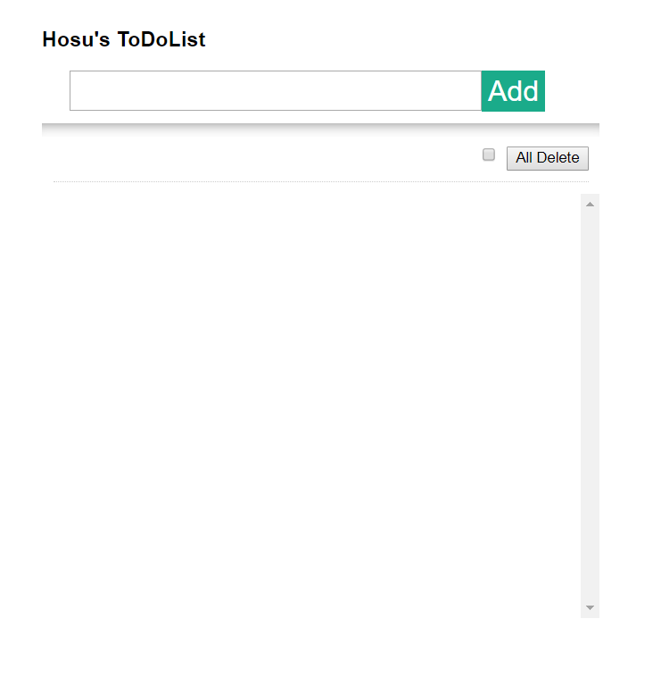


# ToDoList_Hosu

## ✨ Object와 rendering을 활용한 ToDoList 

#### 1. main index display

#### 2. add Event

- input tag에 text를 입력한 후 Add 버튼을 누르면 rendering을 통해
list가 입력된다.

- 그 후 console에서 확인해 보면, array에 잘 입력 된 것을 확인 할 수 있다.

#### 3. eidt Event

- 출력된 list에 text를 수정하고 싶다면 edit button을 클릭해 이벤트를 활성화시킨다.
- 그렇게 되면 배열에 저장되있는 isEdit 값이 true로 바뀌며 contentEditable이 활성화 됩니다.

#### 4. check Event

- 출력된 list에 해결 여부를 확인하려고 checkBox를 활성화 시키기위해 객체에 isChecked라는 속성을 추가해 checked일때 true를 표현했습니다.

- console에서 확인해보면 정상적으로 object의 속성 값이 변경된것을 확인 할 수 있다.
